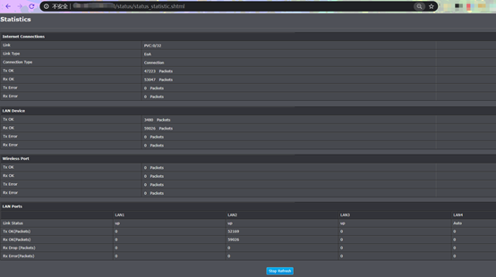
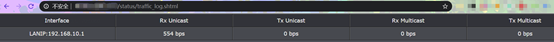
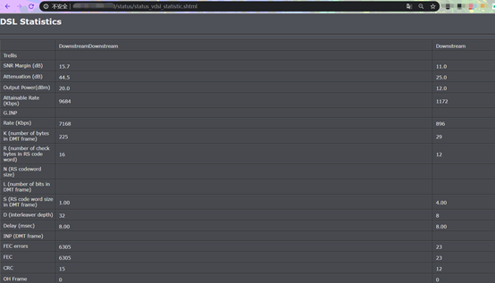

#### Vulnerability Detail
There are several pages in TrendNet TEW-722BRM can be accessed without authorization, which could lead to the leak of vital private information.These pages are "status/status_statistic.shtml", "status/traffic_log.shtml", "status/status_vdsl_statistic.shtml". When processed, it exposes the statistic, traffic log and DSL statistic of router.

#### PoC
http://targetip/status/status_statistic.shtml

http://targetip/status/traffic_log.shtml

http://targetip/status/status_vdsl_statistic.shtml

